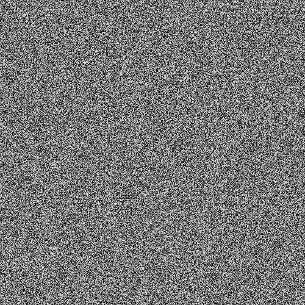

# White Noise Generator
A simple __CLI__ applet written in `Go` to create pictorial representations of [__White Noise__][LINK1].

## Example


## Okay, but how?
An output file of type `.pgm` in plain text (with valid headers) 
is created and that is, in fact, a __Portable GrayMap__. 
You may read more [here][LINK2].

## Download
1. [__Zip Download__][DOWNLOAD]
2. Manual download

```bash
$ git clone git@github.com:michalspano/white-noise.git && cd white-noise
```

## Execute
A compiled binary is available for `Linux` and `MacOS` systems.
```bash
$ .bin/wnoise <...>
```
Manual execution is also available.
```bash
$ go run src/wnoise.go <...>
```

### Windows support
Windows users may use the `.exe` binary that is compiled for `Windows` with a shell script.

#### 64-bit version

```bash
$ bash .win/.win_64-bit.sh
```

#### 32-bit version
```bash
$ bash .win/.win_32-bit.sh
```

**Note:** The `.exe` binaries for `Windows` will be stored in the `bin` folder.

## Usage
### Default use
```bash
$ ./wnoise <width> <height>
```

### Custom use
Used to specify a custom output path with a custom name of the output file.
```bash
$ ./wnoise <width> <height> -d <output_path>
```

### Help flag
See additional help.
```bash
$ ./wnoise <width> <height> -h
```

## Demo
![live_demo][DEMO]

## Development
__Develop__ branch with beta features: [link](develop) (__warning__: might include bugs, use stable version under __main__ branch).

[LINK1]: https://en.wikipedia.org/wiki/White_noise
[LINK2]: https://en.wikipedia.org/wiki/Netpbm
[DOWNLOAD]: https://github.com/michalspano/white-noise/archive/refs/heads/main.zip
[DEMO]: docs/demo.gif
[develop]: https://github.com/michalspano/white-noise/tree/develop
